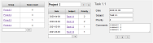
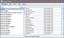
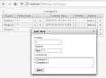
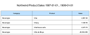
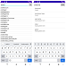
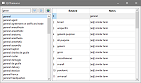

# SQL DAL Maker
SQL DAL Maker is a generator of DTO and DAO classes to access relational databases. Target programming languages: PHP, Java, C++, Python, Ruby, and Go. To generate the class, you declare it in XML meta-program.

Implemented as plug-ins for Eclipse IDE, IntelliJ-Platform, and NetBeans 11+.

Quick-Demo in mp4: [https://github.com/panedrone/sqldalmaker/releases/tag/latest](https://github.com/panedrone/sqldalmaker/releases/tag/latest)

Demo-Projects:
| - | URL |
| --- | --- |
| [PHP/PDO](https://github.com/panedrone/sdm_demo_php_todolist) |  |
| [Java/JDBC/Swing](https://github.com/panedrone/sdm_demo_swing_thesaurus) |  |
| [Java/JDBC/JSF](https://github.com/panedrone/sdm_demo_jsf_todolist) |  |
| [Java/JDBC/Jasper-Reports](https://github.com/panedrone/sdm_demo_jasper_reports_northwindEF) |  |
| [Java/Android](https://github.com/panedrone/sdm_demo_android_thesaurus) |  |
| [C++/Qt6](https://github.com/panedrone/sdm_demo_qt6_thesaurus) |  |
| [Python/Flask](https://github.com/panedrone/sdm_demo_python_flask_todolist) |  |
| [Python/Tkinter](https://github.com/panedrone/sdm_demo_python_tkinter_github_stat) |  |
| [Go/Web](https://github.com/panedrone/sdm_demo_go_todolist) |  |

All the details are here: [sqldalmaker.sourceforge.net](sqldalmaker.sourceforge.net)

