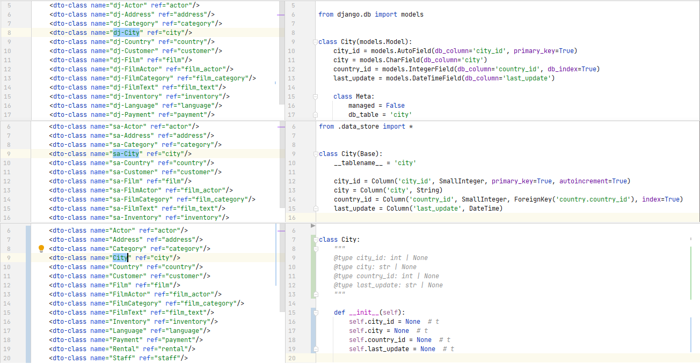

# SQL DAL Maker
SQL DAL Maker is a generator of DTO, Model, and DAO/raw-SQL classes to access relational databases. Target programming languages: PHP, Java, C++, Python, Ruby, and Go. To generate the class, you declare it in XML meta-program.

At the stage of code generation, the target database must exist and be available for JDBC connection.

Code generator uses "live" JDBC metadata to synchronize generated code with the current database schema.

Implemented as plug-ins for [Eclipse IDE](http://marketplace.eclipse.org/content/sql-dal-maker), [IntelliJ-Platform](http://plugins.jetbrains.com/plugin/7092), and [NetBeans 11+](https://github.com/panedrone/sqldalmaker/releases/tag/latest).

Project Website: [http://sqldalmaker.sourceforge.net/](http://sqldalmaker.sourceforge.net/)

Quick-Demo in mp4: [https://github.com/panedrone/sqldalmaker/releases/tag/latest](https://github.com/panedrone/sqldalmaker/releases/tag/latest)

Demo-Projects: [PHP](https://github.com/panedrone/sdm_demo_php_todolist), [Java/Swing](https://github.com/panedrone/sdm_demo_swing_thesaurus), [Java/JSF](https://github.com/panedrone/sdm_demo_jsf_todolist), [Java/Jasper-Reports](https://github.com/panedrone/sdm_demo_jasper_reports_northwindEF), [Java/Android](https://github.com/panedrone/sdm_demo_android_thesaurus), [C++/Qt6](https://github.com/panedrone/sdm_demo_qt6_thesaurus), [Python/Flask-SQLAlchemy](https://github.com/panedrone/sdm_demo_flask_sqlalchemy_todolist), [Python/Tkinter](https://github.com/panedrone/sdm_demo_python_tkinter_github_stat), [Go/Gin](https://github.com/panedrone/sdm_demo_go_todolist)
