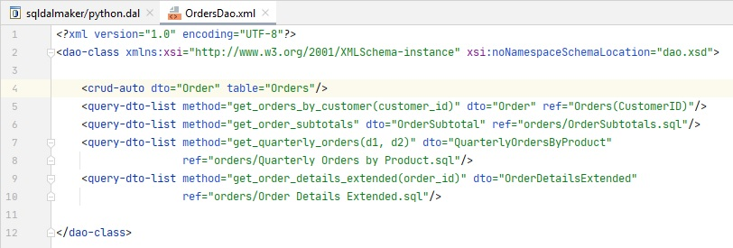

# SQL DAL Maker
SQL DAL Maker is a generator of DTO and DAO classes to access relational databases. Target programming languages: PHP, Java, C++, Python, Ruby. 

To generate the class, you declare it in XML meta-program.

Implemented as plug-ins for Eclipse IDE, IntelliJ Platform, and NetBeans.

All the details are here: [sqldalmaker.sourceforge.net](sqldalmaker.sourceforge.net)

