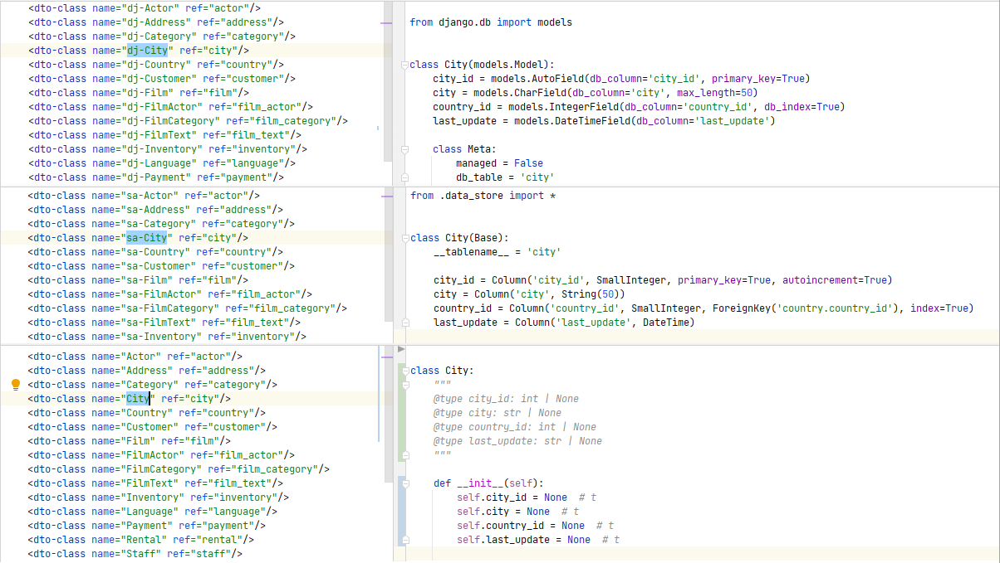

# SQL DAL Maker

SQL DAL Maker is a generator of DTO, Model, and DAO classes to access relational databases. Target
programming languages: PHP, Java, C++, Python, and Go. 

Written in Java. Implemented as plug-ins for [Eclipse IDE](http://marketplace.eclipse.org/content/sql-dal-maker),
[IntelliJ-Platform](http://plugins.jetbrains.com/plugin/7092),
and [NetBeans 11+](https://github.com/panedrone/sqldalmaker/releases/tag/latest).

At the stage of code generation, the target database must exist and be available for JDBC connection.
Generated code is being synchronized with the current database schema using "live" JDBC metadata.

To generate the class, you declare it in XML meta-program.

Project Website: [https://sqldalmaker.sourceforge.net](https://sqldalmaker.sourceforge.net/)

Quick Start in
mp4: [https://github.com/panedrone/sqldalmaker/releases/tag/latest](https://github.com/panedrone/sqldalmaker/releases/tag/latest)

|        | Demo Projects                                                                                                                                                                                                                                                                                                                                                                                                             |
|--------|---------------------------------------------------------------------------------------------------------------------------------------------------------------------------------------------------------------------------------------------------------------------------------------------------------------------------------------------------------------------------------------------------------------------------|
| PHP    | <ul><li>[PDO + Vue.js](https://github.com/panedrone/sdm_demo_php_todolist)</li><li>[Doctrine + Vue.js](https://github.com/panedrone/sdm_demo_todolist_php_doctrine)</li></ul>                                                                                                                                                                                                                                             |
| Java   | <ul><li>[JDBC + JSF](https://github.com/panedrone/sdm_demo_jsf_todolist)</li><li>[JDBC + JasperReports](https://github.com/panedrone/sdm_demo_jasper_reports_northwindEF)</li><li>[Android, SQLite3](https://github.com/panedrone/sdm_demo_android_thesaurus)</li><ul>                                                                                                                                                    |
| C++    | [Qt](https://github.com/panedrone/sdm_demo_qt6_thesaurus)                                                                                                                                                                                                                                                                                                                                                                 |
| Python | <ul><li>[DRF/django.db + Vue.js](https://github.com/panedrone/sdm_demo_todolist_django)</li><li>[FastAPI/SQLAlchemy + Vue.js](https://github.com/panedrone/sdm_demo_todolist_fastapi_sqlalchemy)</li><li>[FastAPI/no-ORM-scenario + Vue.js](https://github.com/panedrone/sdm_demo_fastapi_no_orm_scenario)</li><li>[Flask-SQLAlchemy + Vue.js](https://github.com/panedrone/sdm_demo_todolist_flask_sqlalchemy)</li></ul> |
| Go     | [no-ORM-scenario/Gorm + Vue.js](https://github.com/panedrone/sdm_demo_todolist_sqlite3_golang)                                                                                                                                                                                                                                                                                                                            |